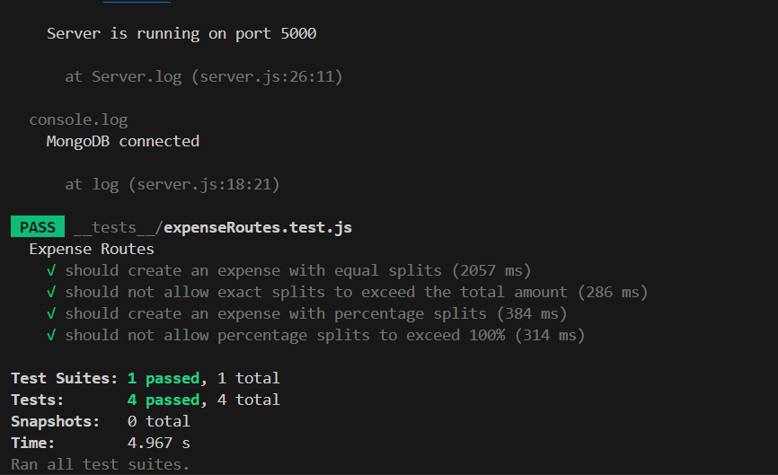

# Daily Expenses Sharing Application

## Objective

This application allows users to add expenses and split them based on three different methods: exact amounts, percentages, and equal splits. The application manages user details, validates inputs, and generates downloadable balance sheets.

## Requirements
#### Node.js
- **Version**: 14.x or later
- Install Node.js from [nodejs.org](https://nodejs.org/).

### User Management
- Each user should have an email, name, and mobile number.
- Registeration and Login can be done.

### Expense Management
- Users can add expenses.
- Expenses can be split using three methods:
  1. **Equal**: Split equally among all participants.
  2. **Exact**: Specify the exact amount each participant owes.
  3. **Percentage**: Specify the percentage each participant owes.


### Balance Sheet
- Show individual expenses.
- Show overall expenses for all users.
- Users can download the balance sheet in excel or pdf.

## 

### API Endpoints

#### User Endpoints
- **Create User**: 
  - `POST /users`
  
- **Get Single User**: 
  - `GET /singleuser/:id`

- **Login User**: 
  - `POST /login`

- **Get All Users**: 
  - `GET /users`

#### Expense Endpoints
- **Add Expense**: 
  - `POST /expenses`

- **Retrieve Individual User Expenses**: 
  - `GET /expenses/user/:id`

- **Retrieve Overall Expenses**: 
  - `GET /expenses`

- **Download Balance Sheet**: 
  - `GET /expenses/balance-sheet`

## Data Validation
- [x] Validate user inputs to ensure correctness.
- [x] Percentages in the percentage split method add up to 100%.
- [x] During exact split greater than the original amount cannot be done.
- [x] Implemented user authentication and authorization.
- [x] Included error handling and input validation.
- [x] Added unit tests.

## Documentation
### Setup and Installation Instructions

1. Clone the repository:
   ```bash
   git clone https://github.com/josephpeter231/Daily-Expense-sharing/
   cd backend
   npm install 
   nodemon server
2. Make sure it displays `Server is running on port 5000`
   (or) run `nodemon server`.

### To run the frontend 

1. ```bash
   cd frontend
   npm install 
   npm run dev 

2. Go to browswer and click the link
 - [http://localhost:5173/](http://localhost:5173/)

## Unit test
1. To run the unit test.
  - ```bash
     cd backend
     npm test
    
  - Test done for Expense Calculation Routes.
    √ should create an expense with equal splits.                                                           
    √ should not allow exact splits to exceed the total amount.                                         
    √ should create an expense with percentage splits.                                                 
    √ should not allow percentage splits to exceed 100%.    

    


  - Test done for User Authentication Routes
    √ should register a new user.                                                                          
    √ should not register a user with an existing email.                                                   
    √ should log in a user.                                                                               
    √ should not log in with incorrect credentials.                                                       
    √ should not log in a non-existent user.

    
   
